# Flowchart Creation Instructions for Copilot

## Overview
These instructions guide the creation of detailed flowcharts for features following Clean Architecture principles. The flowcharts should show complete user journeys from initial interaction through all architectural layers.

## General Requirements

### 1. Feature Analysis
- Explore the feature structure following `structure.instructions.md`
- Go through all layers in the feature to understand functionalities
- Identify all use cases in the `domain/useCases/` directory
- Analyze repository patterns and dependency injection setup

### 2. Documentation Location
- Create flowchart documentation in the feature root directory
- Name the file: `{feature_name}_flowcharts.md` (e.g., `main_setup_flowcharts.md`)
- Focus on creating diagrams for each use case with no extra content beyond flowcharts

## Flowchart Structure Requirements

### 3. Layer Organization with Bounding Boxes
Each flowchart must include clearly defined layer boundaries using Mermaid subgraphs:

```mermaid
subgraph UI["👤 USER INTERACTION"]
    // User trigger points
end

subgraph P["🎨 PRESENTATION LAYER"]
    // Cubit/Bloc state management
end

subgraph D["🧠 DOMAIN LAYER"]
    // Use cases and business logic
end

subgraph DA["💾 DATA LAYER"]
    // Repository implementations and data sources
end
```

### 4. User Interaction Layer (Start Points)
**Always include where users trigger the use case:**
- Show specific UI components (buttons, text fields, screens)
- Include user actions (tap, enter text, swipe, etc.)
- Use descriptive labels like:
  - `"User taps Save button"`
  - `"User enters field value in TextField"`
  - `"User selects item from list"`
  - `"User scans QR code"`

### 5. Layer Communication with Arguments
**Show exactly what data is passed between layers:**

#### Presentation to Domain:
```mermaid
A["updateFieldValue(FieldType, String)"] -->|"fieldType, value"| B["UseCase.call(parameters)"]
```

#### Domain to Data:
```mermaid
B["UseCase.call(GetMeter)"] -->|"GetMeter object"| C["Repository.updateMeter(GetMeter)"]
```

#### Data Layer Internal:
```mermaid
C["Repository"] -->|"GetMeter"| D{Check Connectivity}
D -->|"GetMeter"| E["OnlineRepository.updateMeter(GetMeter)"]
```

### 6. API Path Documentation
**When making API calls, show the complete endpoint:**
```mermaid
K["BaseAPIClient.request"]
L["API Endpoint<br/>POST /api/meter/update<br/>(ID, NotePad, LocationNote, SerialNo)"]
M[API Server]
```

**Include:**
- HTTP method (GET, POST, PUT, DELETE)
- Full endpoint path
- Key parameters being sent
- For database operations, show SQL operation type

### 7. State Management Details
**Show specific state emissions:**
```mermaid
A[Action] --> B["Emit Loading State<br/>MainSetupFieldApiUpdateState(loading)"]
B --> C[Process]
C --> D["Emit Success State<br/>MainSetupFieldApiUpdateState(succeed)"]
```

## Layer-Specific Requirements

### 8. Presentation Layer Details
- Show cubit/bloc method names with parameters
- Include state emission details
- Show UI component interactions
- Display error handling flows

### 9. Domain Layer Details
- Show use case interfaces and implementations
- Include parameter validation
- Show business logic decisions
- Display model transformations

### 10. Data Layer Details
- Show repository factory pattern
- Include connectivity checks
- Display online/offline repository routing
- Show API client configurations
- Include local storage operations
- **Show repository interface implementations**: `SecureStorageService<br/>Implements ISecureStorageService`
- **Display repository dependencies**: Which repositories each use case depends on
- **Show service inheritance**: `ManagerEnvService<br/>Extends BaseEnvService`

## Visual Styling Requirements

### 11. Color Coding
```mermaid
style UserAction fill:#ffecb3,color:#000     // Light yellow for user interactions with black text
style Presentation fill:#e1f5fe,color:#000   // Light blue for presentation layer with black text
style Domain fill:#f3e5f5,color:#000         // Light purple for domain layer with black text
style DataFactory fill:#e8f5e8,color:#000    // Light green for repository factory with black text
style DataConcrete fill:#fff3e0,color:#000   // Light orange for concrete repositories with black text
```

### 12. Connectivity Patterns
**Always show online/offline decision points:**
```mermaid
G{Check Connectivity}
G -->|"Online"| H[OnlineRepository]
G -->|"Offline"| I[OfflineRepository]
```

## Content Requirements

### 13. Comprehensive Coverage
Create flowcharts for:
- All use cases found in `domain/useCases/`
- User-triggered actions (CRUD operations)
- Background processes
- Error handling flows
- State synchronization

### 14. Descriptive Actions
Each node should include:
- Method names with parameters
- Data transformations
- State changes
- API endpoints
- Database operations
- **Repository interface mappings**: Show which interface maps to which implementation
- **Dependency injection indicators**: Show how dependencies are injected (constructor, GetIt, mixin)
- **External use case dependencies**: Highlight when use cases depend on other feature's use cases

### 15. Error Handling
Show error flows:
```mermaid
API -->|"Error Response"| ErrorState["Emit Error State<br/>MainSetupState(error: exception)"]
```

### 16. Repository Dependencies Documentation
**Always include a dedicated repository dependencies section:**

#### Repository Interface Mapping:

```mermaid
flowchart LR
    subgraph UC["🧠 USE CASES"]
        USE_CASE["UseCase<br/>→ Injected Dependencies"]
    end
    
    subgraph REPOS["💾 REPOSITORIES"]
        REPO["Repository<br/>→ IRepository"]
    end
    
    USE_CASE -->|"via DI"| REPO
    
    style USE_CASE fill:#f3e5f5,color:#000
    style REPO fill:#e8f5e8,color:#000
```


#### Dependency Injection Patterns:
- **Constructor Injection**: `UseCase(IRepository repository)`
- **Service Locator**: `GetIt.I<IService>()`
- **Mixin Access**: `via SomeMixin { get repository => GetIt.I<IRepository>() }`

#### Show External Dependencies:
- When use cases depend on other features' use cases
- Cross-feature repository usage
- Shared service dependencies

## Documentation Structure

### 17. File Organization
```markdown
# {Feature} Feature Flowcharts

## 1. {Use Case 1} Use Case
[Flowchart with all requirements]

## 2. {Use Case 2} Use Case
[Flowchart with all requirements]

## Repository Dependencies
[Use Case → Repository mapping diagram]
[Dependency injection details table]
[Service implementations table]

## Layer Architecture Overview
[High-level architecture diagram]

## Legend
[Color coding and symbol explanations]

## Key Features
[Summary of architectural patterns shown]
```

### 18. Legend Requirements
Include comprehensive legend explaining:
- Color coding for each layer
- Symbol meanings
- Architectural patterns used
- Data flow conventions
- **Repository dependency indicators**
- **Dependency injection patterns** (constructor, GetIt, mixin)
- **Interface to implementation mappings**

## Quality Checklist

### 19. Validation Requirements
Before completing, verify:
- [ ] All use cases are covered
- [ ] User interaction start points are shown
- [ ] Layer boundaries are clearly defined
- [ ] Arguments/parameters are documented
- [ ] API paths are included
- [ ] Online/offline flows are shown
- [ ] State emissions are detailed
- [ ] Error handling is included
- [ ] Color coding is consistent
- [ ] Documentation is in feature root
- [ ] **Repository dependencies are clearly shown**
- [ ] **Interface implementations are documented**
- [ ] **Dependency injection patterns are indicated**
- [ ] **External use case dependencies are highlighted**

### 20. Architectural Compliance
Ensure flowcharts demonstrate:
- Clean Architecture principles
- Dependency injection usage
- Repository factory pattern
- State management patterns
- Error propagation
- Data flow integrity

## Example Template

```mermaid
flowchart TD
    subgraph UI["👤 USER INTERACTION"]
        START["User action description<br/>UI Component"]
    end
    
    subgraph P["🎨 PRESENTATION LAYER"]
        A["Cubit method<br/>(parameters)"]
        B["State emission<br/>SpecificState(data)"]
    end
    
    subgraph D["🧠 DOMAIN LAYER"]
        C["UseCase.call<br/>(typed parameters)<br/>→ Uses IRepository"]
    end
    
    subgraph DA["💾 DATA LAYER"]
        E["Repository.method<br/>Implements IRepository<br/>(parameters)"]
        F{Check Connectivity}
        G["OnlineRepository<br/>API: POST /api/endpoint"]
        H["OfflineRepository<br/>Local storage operation"]
    end
    
    START -->|"trigger data"| A
    A -->|"parameters"| C
    C -->|"domain objects"| E
    E -->|"data"| F
    F -->|"online data"| G
    F -->|"offline data"| H
    G --> SUCCESS[Success Response]
    H --> SUCCESS
    SUCCESS --> B
```



This template ensures all requirements are met for comprehensive, architectural-compliant flowcharts.

### Additional Requirements for Repository Visibility

**Enhanced Repository Documentation:**
- Show interface → implementation mappings in node labels
- Indicate dependency injection patterns in use case nodes  
- Include external use case dependencies (cross-feature)
- Add dedicated Repository Dependencies section with mapping diagrams
- Use tables to document dependency injection details
- Show service inheritance relationships
